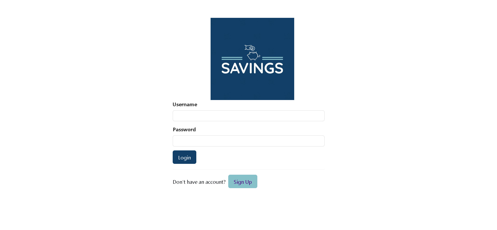
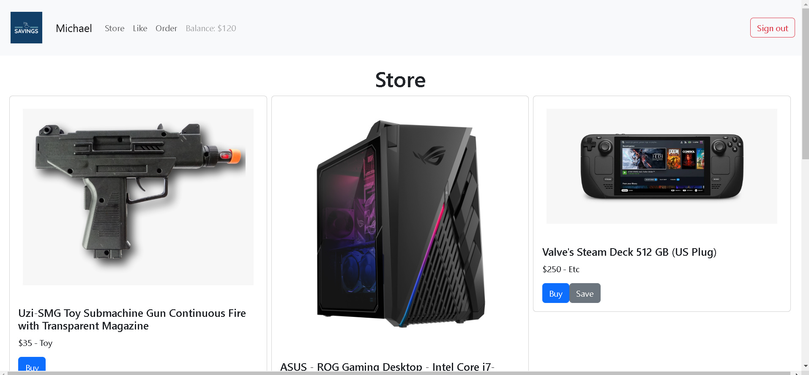
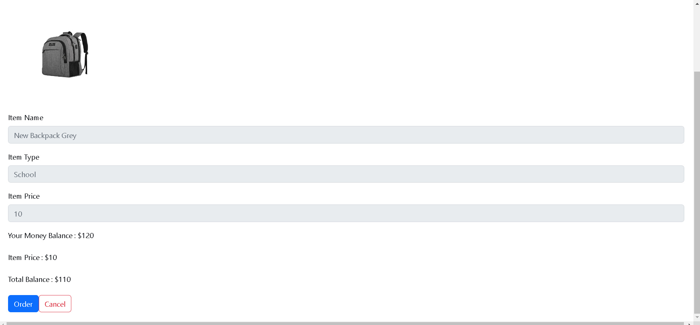
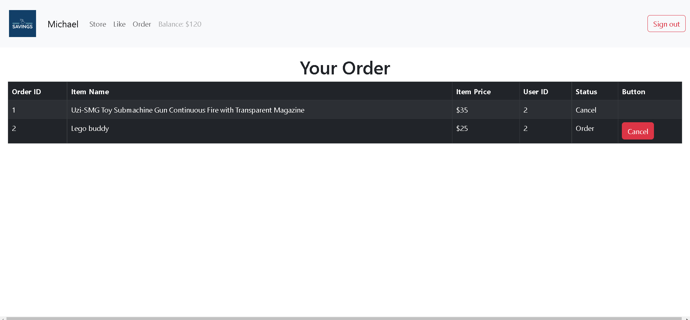
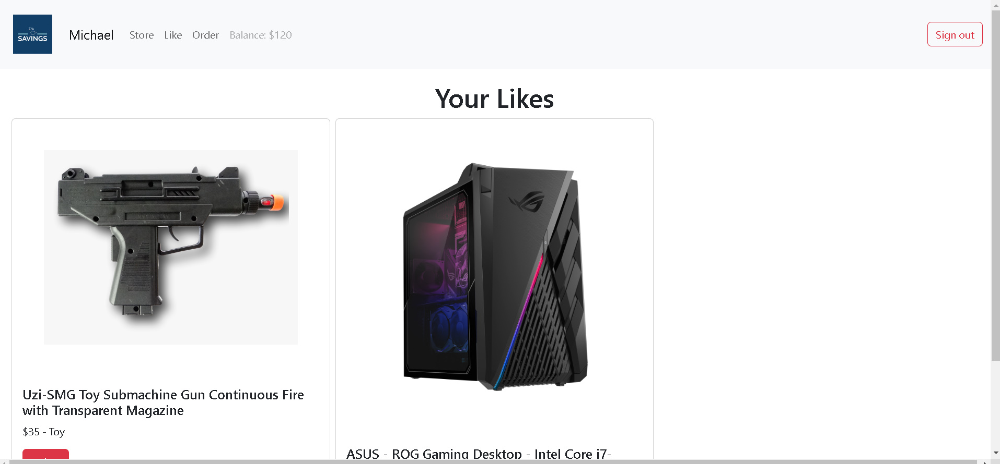
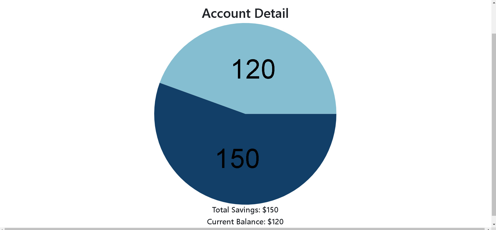
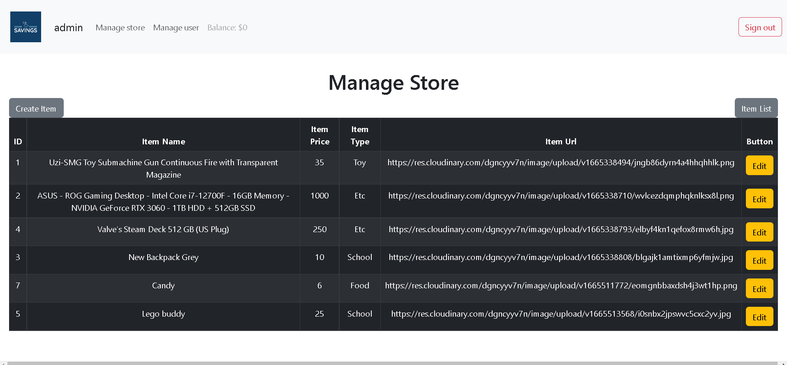
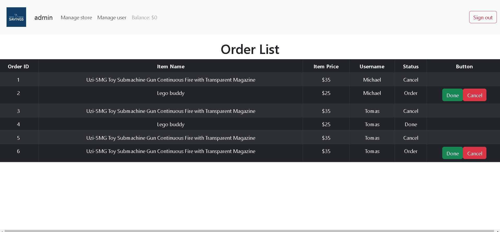

# Savings App By MG

Deployed link : https://phase5-savings-app.herokuapp.com/

Saving App can be used for family to teach their kids to save money and use they money to get something they want. This project using react as front end and ruby as backend, other technology: bootstrap, sweet alert, cloudinary.

## Brief Tutorial

- User : Create account user, login, if have balance can buy items (admin only can add balance to user), order item can be cancelled and will return the balance as long as the status still order, like the items, see the total balance and savings data (User savings = total money from admin, balance is user money for buy items, every order will decrease balance).
- Admin : Create account admin, login, can process order list of users (done or cancel), can add/edit/delete items sold in store, can add/edit/delete user data.

## Table of Contents

- [General Info](#general-information)
- [Tools Used](#tools-used)
- [Features](#features)
- [Screenshots](#screenshots)
- [Room for Improvement](#room-for-improvement)
- [Acknowledgements](#acknowledgements)
- [Contact](#contact)

## General Information

- Each user have their own data
- CRUD Store and User
- Upload Image and save in couldinary
- Balance to buy items
- Simple design website with interactive alert

## Tools Used

- Bootstrap - https://react-bootstrap.github.io/
- Sweetalert2 - https://sweetalert2.github.io/recipe-gallery/sweetalert2-react.html

## Features

List the ready features here:

- User and admin
- Store, order and likes/whistlist (for user)
- Manage store,order and user (for admin)

## Screenshots

## Room for Improvement

There is a plan for improvement with this project, to make this game more interactive.

Room for improvement:

- Improvement to be done page for tutorial
- Improvement to be done layout and design
- Improvement to be done interactive information about savings

## Acknowledgements

- This project was inspired for parenting to teach their kids to save money and get items from savings.
- Many thanks to my Flatiron school lectures
- This is my Phase 5 project at Flatiron school

## Contact

Created by [@mg](https://www.linkedin.com/in/michael-gunawan-030a52194/) - feel free to contact me!
